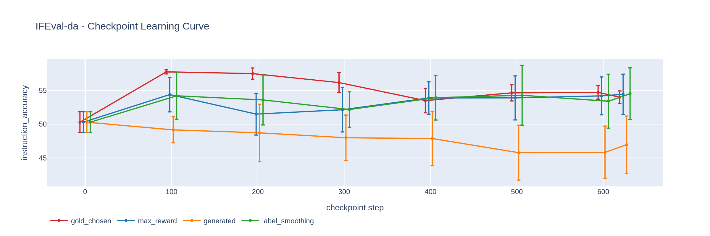

# Generated Mode Ablation

## Hypothesis

Standard generated mode (no max-reward selection, no gold outputs) provides a valid
baseline for comparing construction strategies.

## Method

### Construction Mode: `generated`

1. Generate 4 candidates per prompt
2. Keep **all** generated candidates (no selection)
3. Use original prompt's existing output as **chosen** (if available)
4. Generated candidates become **rejected**

This is the **inverse** of `max_reward`:

- `max_reward`: best generated = chosen, original = rejected
- `generated`: original = chosen, generated = rejected

### Hardware & Runtime

- **GPU:** NVIDIA GB10
- **Training time:** ~8.7 hours
- **Framework:** TRL 1.7.0 + vLLM for generation
- **LoRA:** r=16, α=32, dropout=0.05 (~1% trainable params)

- Final loss: `0.5170`
- Reward accuracy: see training dynamics
- Eval: 3 iterations on full EuroEval suite

### Training

Identical to [Max Reward](01-max-reward.md):

- [DPO](https://arxiv.org/abs/2305.18290) with
  [curriculum learning](https://doi.org/10.1145/1553374.1553380)
- β = 0.1, [LoRA](https://arxiv.org/abs/2106.09685) r=16, LR 5e-6

## Motivation

Tests whether the direction of preference (generated vs original) matters independently
of the reward model's selection.

## Results

**Evaluation suite:** 10 Danish benchmarks from [EuroEval](https://euroeval.com), 3 iterations each.
**Legend:** ▲ significantly better than base Munin-Apertus-8B, ▼ significantly worse (non-overlapping 95% CIs).

| Benchmark            | Task                     | Metric               |     Score | vs Base Model | Status      |
| -------------------- | ------------------------ | -------------------- | --------: | :-----------: | ----------- |
| AngryTweets          | Sentiment classification | MCC                  | **47.38** |       •       | ✅ Complete |
| ScaLA-da             | Linguistic acceptability | MCC                  | **34.58** |       •       | ✅ Complete |
| DANSK                | Named entity recognition | Micro F1             | **43.77** |       •       | ✅ Complete |
| MultiWikiQA-da       | Reading comprehension    | F1                   | **77.34** |       •       | ✅ Complete |
| Nordjylland News     | Summarization            | chrF++               | **38.53** |       •       | ✅ Complete |
| Danske Talemåder     | Knowledge                | Accuracy             | **74.48** |       •       | ✅ Complete |
| Danish Citizen Tests | Knowledge                | Accuracy             | **89.63** |       •       | ✅ Complete |
| HellaSwag-da         | Common sense reasoning   | Accuracy             | **52.08** |       •       | ✅ Complete |
| IFEval-da            | Instruction following    | Instruction accuracy | **49.16** |       •       | ✅ Complete |
| ValEU-da             | European values          | Alignment score      | **20.52** |       •       | ✅ Complete |

## Timeline

| Date       | Milestone          |
| ---------- | ------------------ |
| 2026-06-28 | Training started   |
| 2026-06-29 | Training completed |
| 2026-07-02 | Evals pending      |

## Related

- [Max Reward](01-max-reward.md) — max-reward selection
- [Gold Chosen](02-gold-chosen.md) — expert outputs as chosen

---

## Reproduction

```bash
# 1. Run full pipeline (build + train + eval)
uv run src/scripts/run_pipeline.py --config config/danish-apertus-generated.yaml

# 2. Or resume from existing cache (skip build step)
uv run src/scripts/run_pipeline.py --config config/danish-apertus-generated.yaml --skip-build

# 3. Run evals only (3 iterations)
uv run src/scripts/run_pipeline.py --config config/danish-apertus-generated.yaml --eval-only --eval.num-iterations 3

# 4. Evaluate specific checkpoint
uv run src/scripts/eval_checkpoints.py -m models/croco-munin-apertus-8b-da-generated -l da --num-iterations 3
```

**Tips:**

- `--skip-build` reuses cached `candidates_cache.jsonl` and `pairs_*.jsonl`
- Remove `--skip-build` to regenerate candidates with new generation params
- See `config/danish-apertus-generated.yaml` for full hyperparameters

## Training Dynamics

**Dashboard:** `ssh sparkie ~/croco/croco_dashboard.html` (auto-refreshes every 60s)

### DPO Loss


### Preference Accuracy


### Reward Margin


Interactive Plotly charts in the dashboard:

- **EuroEval learning curves** — checkpoint-by-checkpoint benchmark performance
- **Final comparison** — all experiments with 95% CIs

Hover any chart and click the camera icon (📷) to export as PNG.

### Learning Curves





\*Full interactive curves in dashboard.
