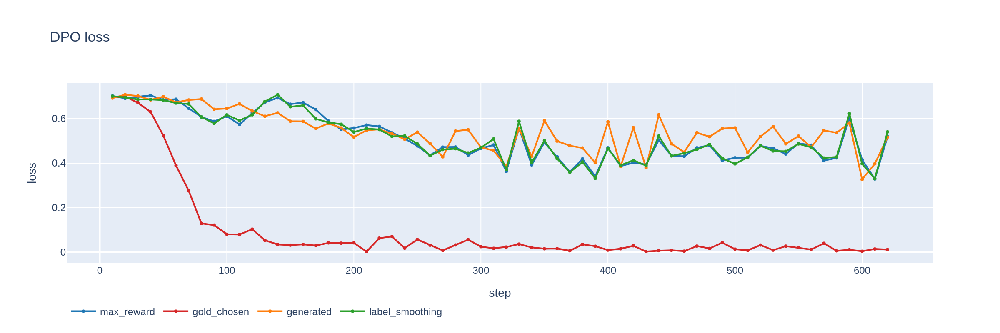
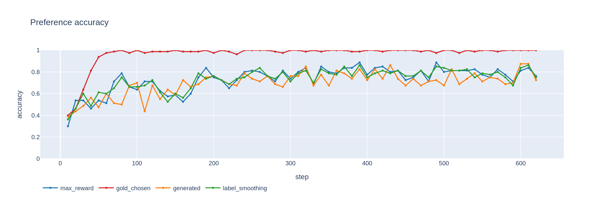
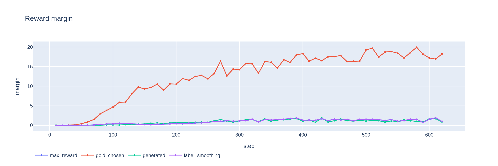

# Generated Mode Ablation

## Hypothesis

Standard generated mode (no max-reward selection, no gold outputs) provides a valid
baseline for comparing construction strategies.

## Method

### Construction Mode: `generated`

Paper-faithful CroCo construction (Eq. 2): **both chosen and rejected are policy
self-generations**; the dataset's gold output is unused (`score_gold_output: false`).

1. Generate 4 candidates per prompt (vLLM, temp=0.7)
2. Score all candidates with Skywork-Reward-V2-Qwen3-8B
3. **Chosen**: highest-reward generation
4. **Rejected**: generation nearest (mean − 2×σ), strictly below the chosen reward

Contrast with `max_reward`, which folds the gold output into the chosen pool:

- `max_reward`: chosen = argmax-reward over {gold} ∪ generations; rejected = (mean − 2×σ) candidate
- `generated`: chosen = highest-reward generation; rejected = (mean − 2×σ) generation (gold unused)

This isolates whether bringing the gold reference into the chosen set (as `max_reward`
does) helps over pure on-policy self-generation.

### Hardware & Runtime

- **GPU:** NVIDIA GB10
- **Training time:** ~8.7 hours
- **Framework:** TRL 1.7.0 + vLLM for generation
- **LoRA:** r=16, α=32, dropout=0.05 (~1% trainable params)

- Final loss: `0.5170`
- Reward accuracy: see training dynamics
- Eval: 10 iterations on full EuroEval suite

### Training

Identical to [Max Reward](01-max-reward.md):

- [DPO](https://arxiv.org/abs/2305.18290) with
  [curriculum learning](https://doi.org/10.1145/1553374.1553380)
- β = 0.1, [LoRA](https://arxiv.org/abs/2106.09685) r=16, LR 5e-6

## Motivation

Tests the fully on-policy CroCo baseline: whether folding the off-policy gold reference
into the chosen pool (as `max_reward` does) actually helps over pure self-generation.

## Results

**Evaluation suite:** 10 Danish benchmarks from [EuroEval](https://euroeval.com), 10 iterations each.
**Legend:** ▲ significantly better than base Munin-Apertus-8B, ▼ significantly worse (non-overlapping 95% CIs).

| Benchmark            | Task                     | Metric               |     Score |          95% CI | vs Base Model | Status      |
| -------------------- | ------------------------ | -------------------- | --------: | --------------: | :-----------: | ----------- |
| AngryTweets          | Sentiment classification | MCC                  | **48.07** |  [45.62, 50.51] |       •       | ✅ Complete |
| ScaLA-da             | Linguistic acceptability | MCC                  | **35.46** |  [32.56, 38.35] |       •       | ✅ Complete |
| DANSK                | Named entity recognition | Micro F1             | **44.19** |  [42.34, 46.05] |       •       | ✅ Complete |
| MultiWikiQA-da       | Reading comprehension    | F1                   | **74.34** |  [72.73, 75.96] |       •       | ✅ Complete |
| Nordjylland News     | Summarization            | chrF++               | **37.38** |  [36.80, 37.96] |       •       | ✅ Complete |
| Danske Talemåder     | Knowledge                | Accuracy             | **67.97** |  [64.97, 70.97] |       •       | ✅ Complete |
| Danish Citizen Tests | Knowledge                | Accuracy             | **83.56** |  [81.05, 86.07] |       •       | ✅ Complete |
| HellaSwag-da         | Common sense reasoning   | Accuracy             | **52.62** |  [49.28, 55.96] |       •       | ✅ Complete |
| IFEval-da            | Instruction following    | Instruction accuracy | **47.21** |  [45.62, 48.79] |       •       | ✅ Complete |
| ValEU-da             | European values          | Alignment score      | **10.08** |   [2.19, 17.97] |       •       | ✅ Complete |

## Timeline

| Date       | Milestone          |
| ---------- | ------------------ |
| 2026-06-28 | Training started   |
| 2026-06-29 | Training completed |
| 2026-07-02 | Evals complete     |

## Related

- [Max Reward](01-max-reward.md) — max-reward selection
- [Gold Chosen](02-gold-chosen.md) — expert outputs as chosen

---


## Learning Curves

All 18 benchmark learning curves:


*See [README](../README.md#learning-curves) for labeled table view.*

## Reproduction

```bash
# 1. Run full pipeline (build + train + eval)
uv run src/scripts/run_pipeline.py --config config/danish-apertus-generated.yaml

# 2. Or resume from existing cache (skip build step)
uv run src/scripts/run_pipeline.py --config config/danish-apertus-generated.yaml --skip-build

# 3. Run evals (standard: 10 iterations, bootstrap 95% CIs)
uv run src/scripts/run_pipeline.py --config config/danish-apertus-generated.yaml --eval-only

# 4. Evaluate specific checkpoint
uv run src/scripts/eval_checkpoints.py -m models/croco-munin-apertus-8b-da-generated -l da
```

**Tips:**

- `--skip-build` reuses cached `candidates_cache.jsonl` and `pairs_*.jsonl`
- Remove `--skip-build` to regenerate candidates with new generation params
- See `config/danish-apertus-generated.yaml` for full hyperparameters

## Training Dynamics

**Dashboard:** `croco_dashboard.html` — regenerate with `python src/scripts/build_dashboard.py`

### DPO Loss



### Preference Accuracy



### Reward Margin



Interactive Plotly charts in the dashboard:

- **EuroEval learning curves** — checkpoint-by-checkpoint benchmark performance
- **Final comparison** — all experiments with 95% CIs

Hover any chart and click the camera icon (📷) to export as PNG.


