# CroCo Research Experiments

Overview of all research experiments and ablation studies in the CroCo project. Each
experiment tests a specific hypothesis about preference optimisation for LLM alignment.

## Pipeline Overview

All experiments follow the **CroCo (Contrastive Preference Optimization)** pipeline:

1. **Build**: Construct preference pairs via candidate generation + reward scoring
2. **Train**: [DPO](https://arxiv.org/abs/2305.18290) with
   [curriculum learning](https://doi.org/10.1145/1553374.1553380) (gated access by
   evolution score)
3. **Evaluate**: Danish language benchmarks (10 iter final + 3 iter checkpoint evals)

Base model: `danish-foundation-models/munin-apertus-8b`  
Reward model: `Skywork/Skywork-Reward-V2-Qwen3-8B`  
Dataset: Laerebogen (evolved subset), stratified by evolution score

---

## Experiment Catalogue

### Construction Mode Ablations

| Experiment                           | Description                                                             | Status      |
| ------------------------------------ | ----------------------------------------------------------------------- | ----------- |
| [**Max Reward**](01-max-reward.md)   | `max_reward` construction: generate 4 candidates, select best as chosen | ✅ Complete |
| [**Gold Chosen**](02-gold-chosen.md) | Use Qwen3-235B outputs as chosen instead of policy generations          | ✅ Complete |
| [**Generated**](03-generated.md)     | Standard generated mode: keep all candidates, score against prompts     | ✅ Complete |
| [**Llama RM**](04-llama-rm.md)       | Substitute Skywork RM with Llama-3-based reward model                   | 🏃 Running  |

### Loss Function Ablations

| Experiment                                    | Description                                                                               | Status      |
| --------------------------------------------- | ----------------------------------------------------------------------------------------- | ----------- |
| [**Label Smoothing**](05-label-smoothing.md)  | `max_reward` + label smoothing (α=0.05) for robustness to noisy RM labels       | ✅ Complete |
| [**SimPO (β=0.1)**](06-simpo.md)              | Length-normalised loss with low β (clean single-variable ablation)                        | 🏃 Running  |
| [**SimPO Tuned (β=2.0)**](07-simpo-tuned.md)  | Raise β to [SimPO](https://arxiv.org/abs/2405.14734)-recommended 2.0, keep `sigmoid_norm` | ⏳ Queued   |
| [**SimPO Full (ref-free)**](08-simpo-full.md) | True ref-free SimPO loss + target margin γ=0.5                                            | ⏳ Queued   |

### Online RL Baseline

| Experiment             | Description                                                                                                                       | Status    |
| ---------------------- | --------------------------------------------------------------------------------------------------------------------------------- | --------- |
| [**GRPO**](09-grpo.md) | Group Relative Policy Optimization: online RL with vLLM-colocate rollouts ([Shao et al., 2024](https://arxiv.org/abs/2402.03300)) | ⏳ Queued |

---

## Hyperparameter Summary

| Experiment      | β (temp) | Loss Type        | Target Margin (γ) | Curriculum | Ref Model |
| --------------- | -------- | ---------------- | ----------------- | ---------- | --------- |
| Max Reward      | 0.1      | standard (exp)   | —                 | ✓          | ✓         |
| Gold Chosen     | 0.1      | standard (exp)   | —                 | ✓          | ✓         |
| Generated       | 0.1      | standard (exp)   | —                 | ✓          | ✓         |
| Llama RM        | 0.1      | standard (exp)   | —                 | ✓          | ✓         |
| Label Smoothing | 0.1      | standard (exp)   | —                 | ✓          | ✓         |
| SimPO           | 0.1      | `sigmoid_norm`   | —                 | ✓          | ✓         |
| SimPO Tuned     | 2.0      | `sigmoid_norm`   | —                 | ✓          | ✓         |
| SimPO Full      | 2.0      | `simpo` (custom) | 0.5               | ✓          | ✗         |
| GRPO            | 0.04     | GRPO loss        | —                 | ✓          | ✗         |

---

## Key Findings

### Construction Mode (vs Munin-Apertus-8B base)

| Experiment      | Best Result      | Significant Improvements ▲ | Significant Degradations ▼     |
| --------------- | ---------------- | -------------------------- | ------------------------------ |
| **Max Reward**  | IFEval-da: 56.13 | Instruction following      | —                              |
| **Gold Chosen** | IFEval-da: 54.25 | Instruction following      | ScaLA-da ▼, Nordjylland News ▼ |
| **Generated**   | —                | —                          | — (no significant differences) |

**Takeaway:** Generated mode is safest (no degradation), but Max Reward improves instruction following without trade-offs.

### Loss Functions (vs base)

| Experiment                       | Best Result      | Significant Improvements ▲ | Significant Degradations ▼ |
| -------------------------------- | ---------------- | -------------------------- | -------------------------- |
| **Label Smoothing** (max_reward) | IFEval-da: 54.47 | Instruction following      | —                          |

**Takeaway:** Label smoothing (α=0.05) with `max_reward` construction improves instruction following while maintaining parity elsewhere — validates Robust DPO approach.

### Online RL

- **GRPO**: ⏳ Queued — will test online RL vs offline DPO trade-offs

---

## Benchmark Results Summary

**Benchmark scores** from [EuroEval](https://euroeval.com) v17.5.0.

| Experiment | Iterations | CIs Available |
|------------|------------|---------------|
| Completed (01, 02, 03, 05) | 3 (historical) | Mean scores only — CIs require 10 iterations |
| Ongoing / Future | 10 (standard) | ✅ Yes — bootstrap 95% CIs |

**Significance markers** (▲▼) in tables below based on non-overlapping 95% CIs where available; otherwise on point estimates.

| Dataset              | Metric     | Base Model | Max Reward |    Gold | Generated | Label Smooth |
| -------------------- | ---------- | ---------: | ---------: | ------: | --------: | -----------: |
| AngryTweets          | MCC        |      48.05 |      48.68 |   46.60 |     47.38 |        46.52 |
| ScaLA-da             | MCC        |      35.70 |      35.70 | 28.80 ▼ |     34.58 |        34.81 |
| DANSK                | Micro F1   |      45.20 |      45.20 |   43.00 |     44.19 |        44.59 |
| MultiWikiQA-da       | F1         |      74.60 |      74.60 |   77.47 |     77.34 |        77.92 |
| Nordjylland News     | chrF++     |      37.62 |      37.62 | 34.20 ▼ |     37.38 |        37.59 |
| Danske Talemåder     | Accuracy   |      62.62 |      70.78 |   75.00 |     74.48 |        75.00 |
| Danish Citizen Tests | Accuracy   |      77.59 |      84.44 |   85.93 |     89.63 |        90.00 |
| HellaSwag-da         | Accuracy   |      41.57 |      54.96 |   52.99 |     52.08 |        52.21 |
| IFEval-da            | Instr. Acc |      56.13 |    56.13 ▲ | 57.76 ▲ |     49.16 |      54.51 ▲ |
| ValEU-da             | Alignment  |      10.08 |       5.45 |   10.61 |     20.52 |        23.78 |

**Legend:** ▲ significantly better than base (p<0.05), ▼ significantly worse

**Statistical methodology:** Significance via non-overlapping 95% CIs (bootstrap, 1000
samples). [EuroEval](https://euroeval.com) v17.5.0 with fixed seeds; scores are mean across 10 independent runs.

---

## Dashboard

**Access:** Generate locally with `python src/scripts/build_dashboard.py`

Interactive Plotly dashboard with:

- **Training dynamics** — loss, reward accuracy, reward margin per step
- **EuroEval learning curves** — checkpoint-by-checkpoint performance (10 datasets)
- **Final comparison** — all experiments with 95% confidence intervals

**Export:** Hover any chart → click camera icon (📷) → download as PNG (2x scale).

Dashboard HTML is self-contained with embedded data.

### Embedded Plots

Each completed experiment doc includes training dynamics plots:

- [Max Reward](01-max-reward.md), [Gold Chosen](02-gold-chosen.md),
  [Generated](03-generated.md), [Label Smoothing](05-label-smoothing.md)
- **DPO Loss**, **Preference Accuracy**, **Reward Margin** (PNG exports from dashboard)

### Final Comparison

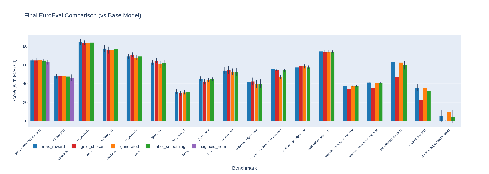

_Bars show mean scores; error bars are 95% confidence intervals (bootstrap, 1000 samples).
Significance determined by non-overlapping CIs._

### Learning Curves

All 18 dataset-metric combinations (checkpoint-by-checkpoint performance):

| Dataset & Metric | Learning Curve | Dataset & Metric | Learning Curve |
|------------------|----------------|------------------|----------------|
| **Angry Tweets** Macro F1 | 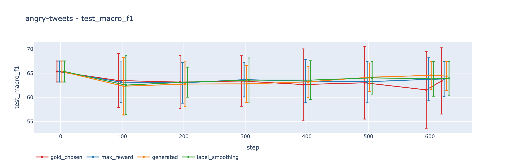 | **Angry Tweets** MCC | 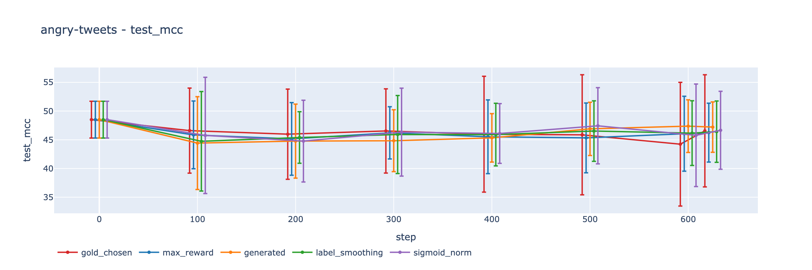 |
| **Danish Citizen Tests** Accuracy | 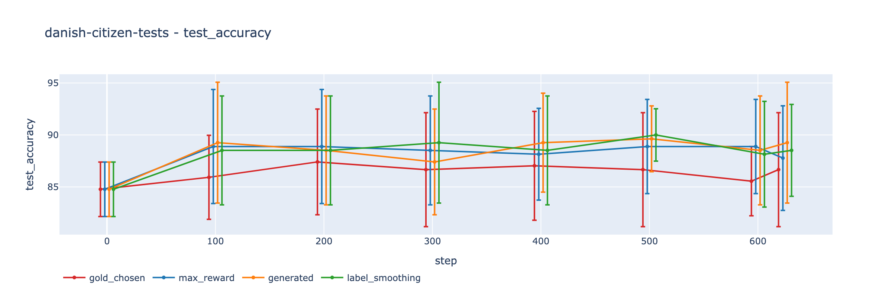 | **Danish Citizen Tests** MCC | 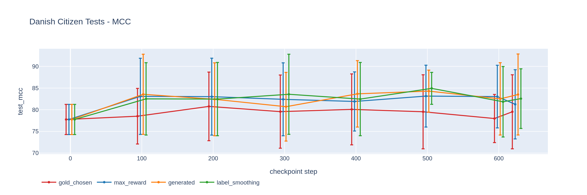 |
| **Dansk (NER)** Micro F1 | 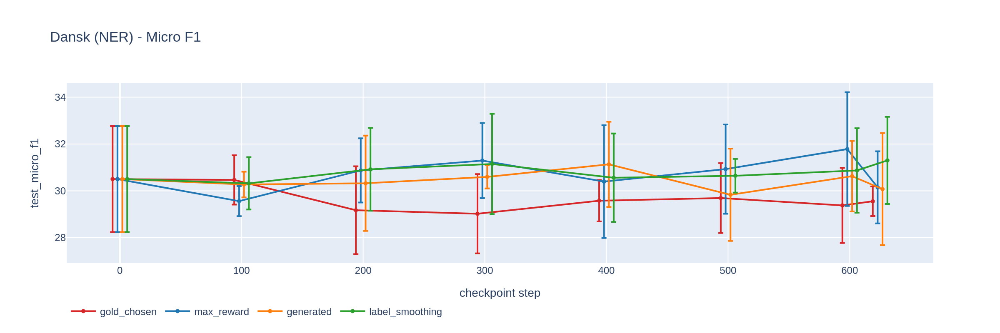 | **Dansk (NER)** Micro F1 (no misc) | 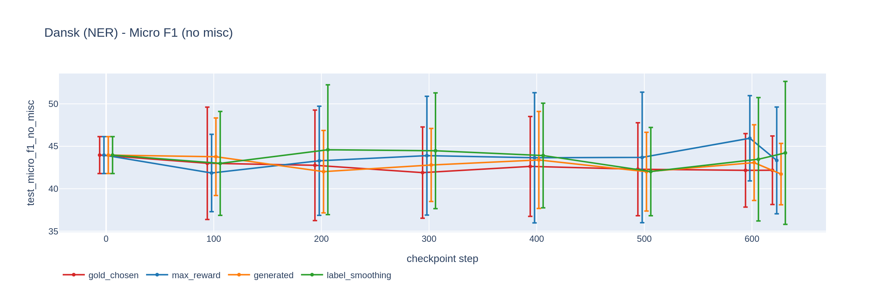 |
| **Danske Talemåder** Accuracy | 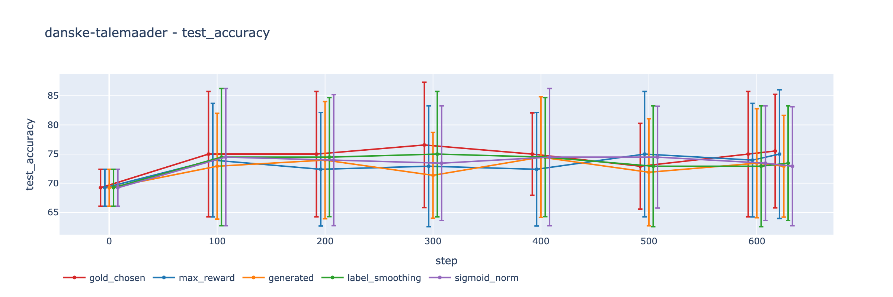 | **Danske Talemåder** MCC | 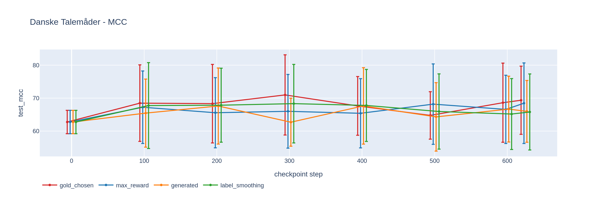 |
| **Hellaswag-da** Accuracy | 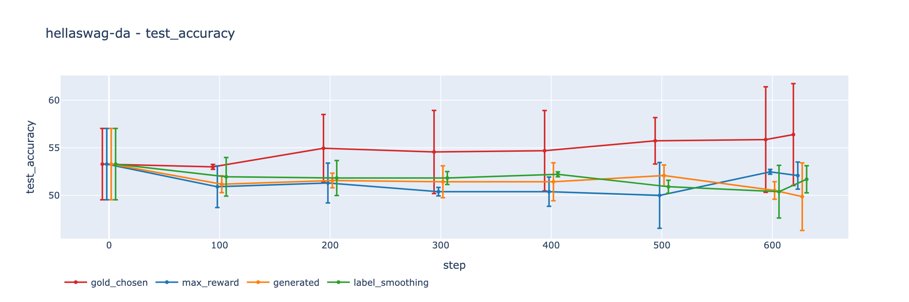 | **Hellaswag-da** MCC | 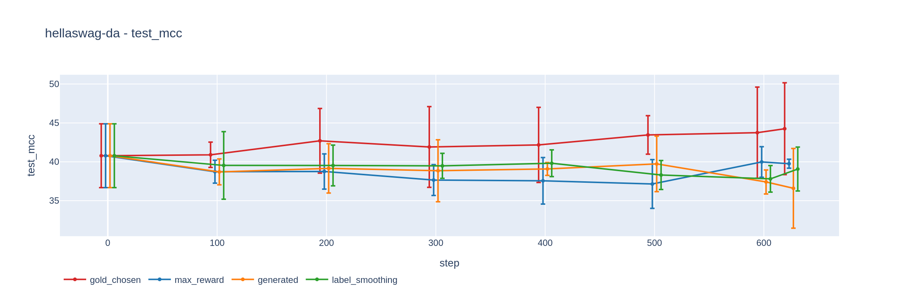 |
| **IFEval-da** Instruction Accuracy | 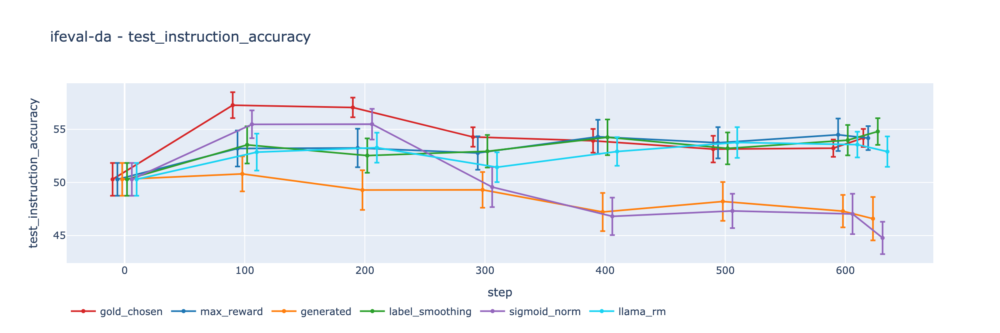 | **Multi-Wiki QA-da** Exact Match | 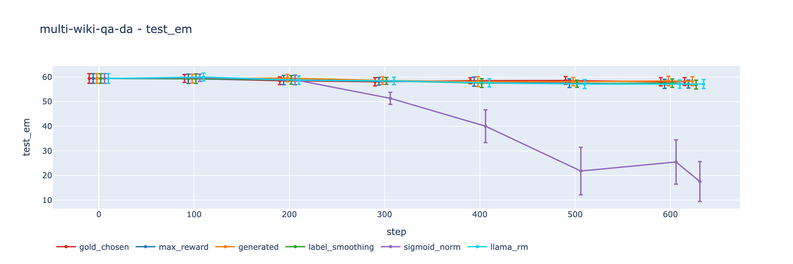 |
| **Multi-Wiki QA-da** F1 | 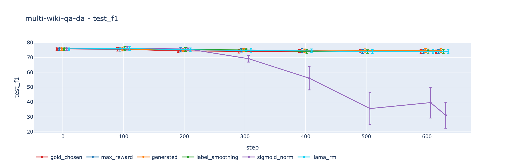 | **Nordjylland News** chrF3++ | 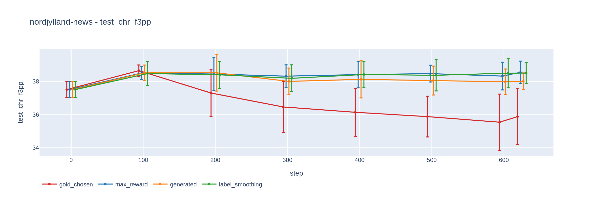 |
| **Nordjylland News** chrF4++ | 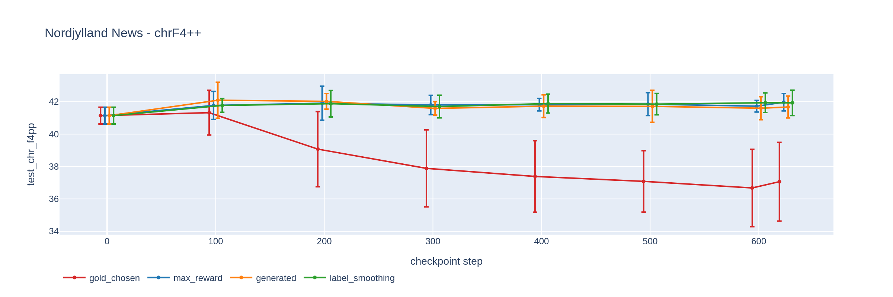 | **ScaLA-da** Macro F1 | 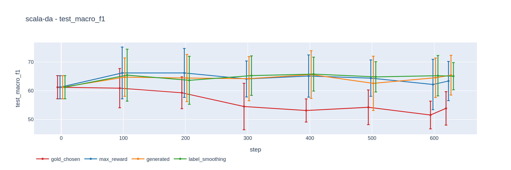 |
| **ScaLA-da** MCC | 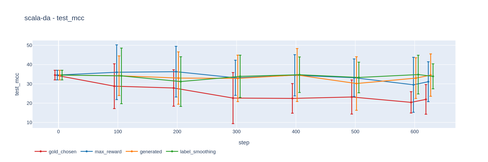 | **ValEU-da** European Values | 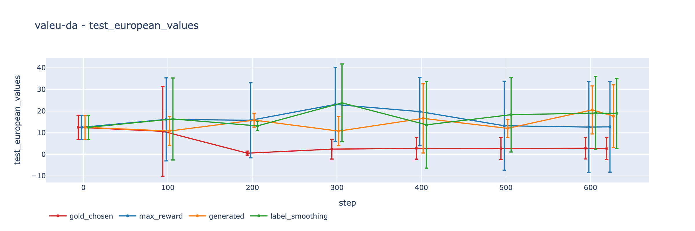 |

*Error bars show 95% CIs (bootstrap, 1000 samples); runs dodged horizontally for visibility.*

---

## Configs

All configs in `config/` directory:

| Config                           | Construction Mode | Description                      |
| -------------------------------- | ----------------- | -------------------------------- |
| `danish-apertus.yaml`            | `max_reward`      | Select best-scoring candidate    |
| `danish-apertus-gold.yaml`       | `gold_chosen`     | Use Qwen3-235B outputs as chosen |
| `danish-apertus-generated.yaml`  | `generated`       | Keep all candidates, score all   |
| `danish-apertus-ls.yaml`         | `max_reward`      | DPO with label smoothing (α=0.05)|
| `danish-apertus-simpo.yaml`      | `max_reward`      | SimPO loss (γ=0.5, β=2.0)        |
| `danish-apertus-llama-rm.yaml`   | `max_reward`      | Llama-3-based reward model       |

---

## Timeline

| Date             | Milestone                                  |
| ---------------- | ------------------------------------------ |
| 2026-06-28       | Initial CroCo runs (main, gold, generated) |
| 2026-06-29       | RM ablation (Llama vs Skywork)             |
| 2026-06-30       | Loss ablations started (ls, simpo)         |
| 2026-07-02       | SimPO ablations queued (tuned, full)       |
| 2026-07-04 (est) | GRPO baseline completes                    |

---

## Configs

All configs in `config/` directory:

| Config                           | Construction Mode | Description                      |
| -------------------------------- | ----------------- | -------------------------------- |
| `danish-apertus.yaml`            | `max_reward`      | Select best-scoring candidate    |
| `danish-apertus-gold.yaml`       | `gold_chosen`     | Use Qwen3-235B outputs as chosen |
| `danish-apertus-generated.yaml`  | `generated`       | Keep all candidates, score all   |
| `danish-apertus-ls.yaml`         | `max_reward`      | DPO with label smoothing (α=0.05)|
| `danish-apertus-simpo.yaml`      | `max_reward`      | SimPO loss (γ=0.5, β=2.0)        |
| `danish-apertus-llama-rm.yaml`   | `max_reward`      | Llama-3-based reward model       |

---

## Timeline

| Date             | Milestone                                  |
| ---------------- | ------------------------------------------ |
| 2026-06-28       | Initial CroCo runs (main, gold, generated) |
| 2026-06-29       | RM ablation (Llama vs Skywork)             |
| 2026-06-30       | Loss ablations started (ls, simpo)         |
| 2026-07-02       | SimPO ablations queued (tuned, full)       |
| 2026-07-04 (est) | GRPO baseline completes                    |
